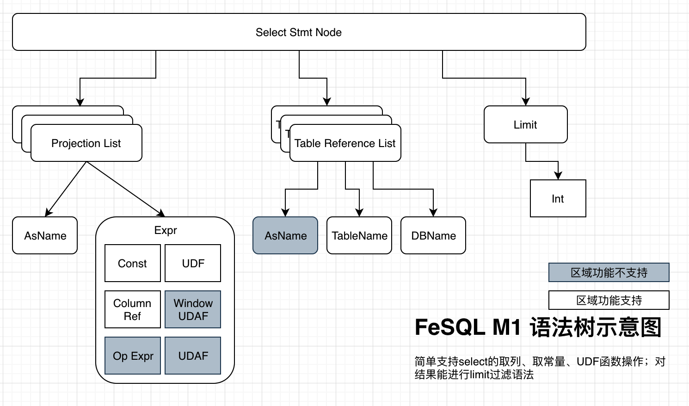
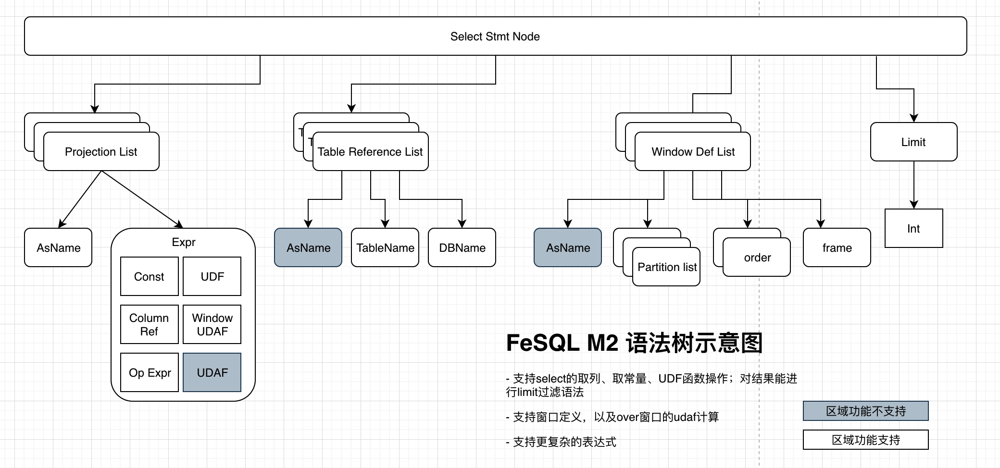

# FeSQL 1.0 查询分析




### 语法树示例:

```SQL
SELECT trim(COL1) as trim_col1 FROM t1;
ret: 0 list size:1
[
	+-node[kSelectStmt]
	 	+-where_clause: null
	 	+-group_clause: null
	 	+-haveing_clause: null
	 	+-order_clause: null
	 	+-limit: null
	 	+-select_list[list]: 
	 	|	+-0:
	 	|	 	+-node[kResTarget]
	 	|	 	 	+-val:
	 	|	 	 	|	+-node[kFunc]
	 	|	 	 	|	 	function_name: trim
	 	|	 	 	|	 	+-args[list]: 
	 	|	 	 	|	 	|	+-0:
	 	|	 	 	|	 	|	 	+-node[kColumn]
	 	|	 	 	|	 	|	 	 	+-relation_name: 
	 	|	 	 	|	 	|	 	 	+-column_name: COL1
	 	|	 	 	|	 	+-over: null
	 	|	 	 	+-name: trim_col1
	 	+-tableref_list[list]: 
	 	|	+-0:
	 	|	 	+-node[kTable]
	 	|	 	 	+-table: t1
	 	|	 	 	+-alias: 
	 	+-window_list: []
]
```


# FeSQL 2.0 查询分析



### 语法树示例: 

```SQL
SELECT COL1, trim(COL2), TS, AVG(AMT) OVER w, SUM(AMT) OVER w FROM t 
WINDOW w AS (PARTITION BY COL2
              ORDER BY TS ROWS BETWEEN 3 PRECEDING AND 3 FOLLOWING);
ret: 0 list size:1
[
	+-node[kSelectStmt]
	 	+-where_clause: null
	 	+-group_clause: null
	 	+-haveing_clause: null
	 	+-order_clause: null
	 	+-limit: null
	 	+-select_list[list]: 
	 	|	+-0:
	 	|	|	+-node[kResTarget]
	 	|	|	 	+-val:
	 	|	|	 	|	+-node[kColumn]
	 	|	|	 	|	 	+-relation_name: 
	 	|	|	 	|	 	+-column_name: COL1
	 	|	|	 	+-name: 
	 	|	+-1:
	 	|	|	+-node[kResTarget]
	 	|	|	 	+-val:
	 	|	|	 	|	+-node[kFunc]
	 	|	|	 	|	 	function_name: trim
	 	|	|	 	|	 	+-args[list]: 
	 	|	|	 	|	 	|	+-0:
	 	|	|	 	|	 	|	 	+-node[kColumn]
	 	|	|	 	|	 	|	 	 	+-relation_name: 
	 	|	|	 	|	 	|	 	 	+-column_name: COL2
	 	|	|	 	|	 	+-over: null
	 	|	|	 	+-name: 
	 	|	+-2:
	 	|	|	+-node[kResTarget]
	 	|	|	 	+-val:
	 	|	|	 	|	+-node[kColumn]
	 	|	|	 	|	 	+-relation_name: 
	 	|	|	 	|	 	+-column_name: TS
	 	|	|	 	+-name: 
	 	|	+-3:
	 	|	|	+-node[kResTarget]
	 	|	|	 	+-val:
	 	|	|	 	|	+-node[kFunc]
	 	|	|	 	|	 	function_name: AVG
	 	|	|	 	|	 	+-args[list]: 
	 	|	|	 	|	 	|	+-0:
	 	|	|	 	|	 	|	 	+-node[kColumn]
	 	|	|	 	|	 	|	 	 	+-relation_name: 
	 	|	|	 	|	 	|	 	 	+-column_name: AMT
	 	|	|	 	|	 	+-over:
	 	|	|	 	|	 	 	+-node[kWindowDef]
	 	|	|	 	|	 	 	+-window_name: w
	 	|	|	 	|	 	 	+-partitions: []
	 	|	|	 	|	 	 	+-orders: []
	 	|	|	 	|	 	 	+-frame: null
	 	|	|	 	+-name: 
	 	|	+-4:
	 	|	 	+-node[kResTarget]
	 	|	 	 	+-val:
	 	|	 	 	|	+-node[kFunc]
	 	|	 	 	|	 	function_name: SUM
	 	|	 	 	|	 	+-args[list]: 
	 	|	 	 	|	 	|	+-0:
	 	|	 	 	|	 	|	 	+-node[kColumn]
	 	|	 	 	|	 	|	 	 	+-relation_name: 
	 	|	 	 	|	 	|	 	 	+-column_name: AMT
	 	|	 	 	|	 	+-over:
	 	|	 	 	|	 	 	+-node[kWindowDef]
	 	|	 	 	|	 	 	+-window_name: w
	 	|	 	 	|	 	 	+-partitions: []
	 	|	 	 	|	 	 	+-orders: []
	 	|	 	 	|	 	 	+-frame: null
	 	|	 	 	+-name: 
	 	+-tableref_list[list]: 
	 	|	+-0:
	 	|	 	+-node[kTable]
	 	|	 	 	+-table: t
	 	|	 	 	+-alias: 
	 	+-window_list[list]: 
	 	 	+-0:
	 	 	 	+-node[kWindowDef]
	 	 	 	+-window_name: w
	 	 	 	+-partitions[list]: 
	 	 	 	|	+-0:
	 	 	 	|	 	+-node[kColumn]
	 	 	 	|	 	 	+-relation_name: 
	 	 	 	|	 	 	+-column_name: COL2
	 	 	 	+-orders[list]: 
	 	 	 	|	+-0:
	 	 	 	|	 	+-node[kOrderBy]
	 	 	 	|	 	 	+-sort_type: unknown
	 	 	 	|	 	 	+-order_by:
	 	 	 	|	 	 	 	+-node[kColumn]
	 	 	 	|	 	 	 	 	+-relation_name: 
	 	 	 	|	 	 	 	 	+-column_name: TS
	 	 	 	+-frame:
	 	 	 	 	+-node[kFrame]
	 	 	 	 	 	+-type: kFrameRows
	 	 	 	 	 	+-start:
	 	 	 	 	 	|	+-node[kBound]
	 	 	 	 	 	|	 	+-bound: kPreceding
	 	 	 	 	 	|	 	 	+-node[kInt]
	 	 	 	 	 	|	 	 	 	+-value: 3
	 	 	 	 	 	+-end:
	 	 	 	 	 	 	+-node[kBound]
	 	 	 	 	 	 	 	+-bound: kFollowing
	 	 	 	 	 	 	 	 	+-node[kInt]
	 	 	 	 	 	 	 	 	 	+-value: 3
]
```


